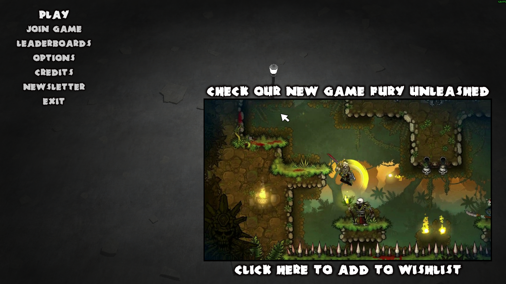
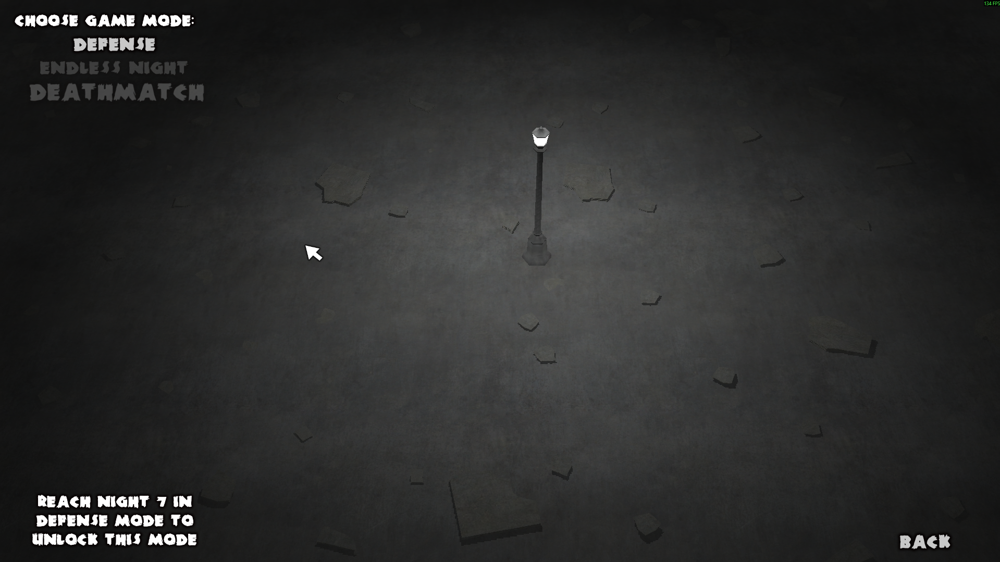
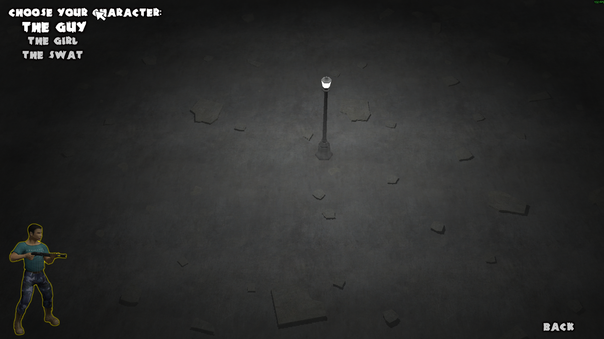
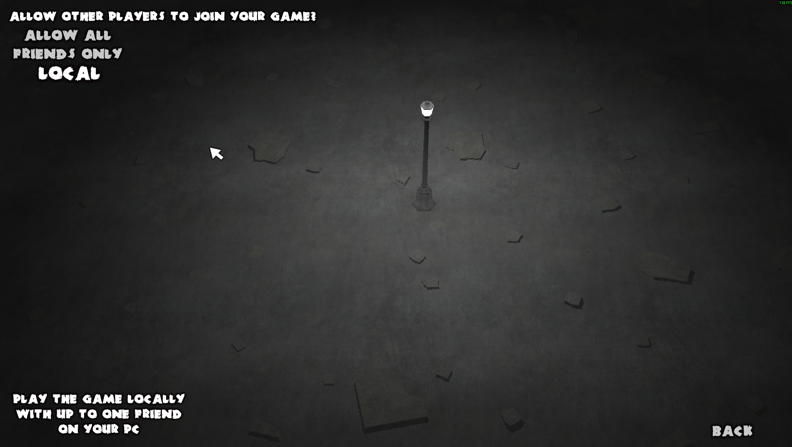

# 📂 Menu Flow — Menü Akışı

**Oyun:** Yet Another Zombie Defense  
**Kategori:** UI/UX → MenuFlow  
**Amaç:** Oyuncunun oyun içi ve oyun dışı menüleri nasıl gezdiğini, navigasyon akışını ve UI/UX tasarımını detaylandırmak.

---

## 🌌 Menü Konsepti

- **Minimalist ve anlaşılır:** Tek alan ve tek ışık kaynağı ile oynandığından menüler hızlı ve kesintisiz erişim sağlamalı.  
- **Odak Noktası:** Başlangıç menüsü, pause menüsü, settings menüsü ve oyun sonu ekranları.

---

## 🔄 Menü Yapısı

1. **Main Menu (Başlangıç Menüsü)**  
   - Play / Multiplayer / Options / Exit  
   - Seçenekler arası navigasyon için keyboard, controller veya mouse desteği.  

2. **Pause Menu (Oyun İçi Duraklatma)**  
   - Resume / Restart / Options / Exit to Main Menu  
   - Oyuncu oyun sırasında menüyü açtığında gameplay durdurulur ve seçimler yapılabilir.  

3. **Options / Settings Menu**  
   - Ses seviyesi, kontrol ayarları, grafik seçenekleri, language seçimi.  
   - Slider, checkbox ve dropdown UI öğeleri ile tasarlanır.  

4. **Game Over / Victory Screen**  
   - Skor, öldürülen düşman sayısı, oynanan süre ve leaderboard bilgisi.  
   - Retry veya Main Menu butonları.  

5. **Multiplayer Lobby (Opsiyonel)**  
   - Arkadaşlarla online oynamak için lobby sistemi.  
   - Ready / Start / Player List / Chat UI öğeleri.

---

## ⚙️ UE5 Tasarım Önerileri

| Menü Türü | Unreal Engine 5 Uygulaması |
|-----------|---------------------------|
| Main Menu | UMG Widget → Vertical / Horizontal Box + Button Bindings |
| Pause Menu | Widget Overlay → Bind Resume / Restart Events |
| Options | UMG Slider, Checkbox, ComboBox → Bind Settings Variables |
| Game Over / Victory | Widget + Animation → Skor ve puan bilgisi Display |
| Navigation | `Set Input Mode UI Only/Game and UI` → Keyboard, Controller, Mouse destekli |
| Multiplayer | `PlayerState` veya `GameInstance` → Lobby Widget Bindings |

---

## 💡 Geliştirme Notları

- Menüler hızlı ve sezgisel olmalı; oyun akışını kesmemeli.  
- Oyun içi ve oyun dışı menü navigasyonu, oyuncuya kontrol hissi vermeli.  
- Animasyon ve görsel feedback, menü etkileşimini daha anlaşılır kılar.  
- Multiplayer modda lobby ve ready durumları her oyuncuya ayrı ve senkronize gösterilmeli.

---

## 📌 Özet

> MenuFlow.md, oyuncunun oyun içi ve oyun dışı menüleri nasıl gezdiğini ve hangi UI öğeleri ile etkileşimde bulunduğunu detaylandırır.  
> Unreal Engine 5’te UMG Widget Blueprint ve Input Mode yönetimi ile prototiplenebilir ve dinamik hale getirilebilir.

## 📌 Referans Menu Akış Görselleri

